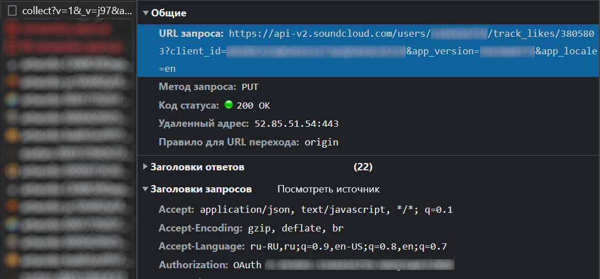

# SoundCloud tracklist transfer
This script allows you to transfer your tracks to the SoundCloud platform.

## What is its purpose
I did not find a free way to transfer my tracks to SoundCloud, so I decided to do it myself.

If you find yourself in the same position, you can use what I found out

## Downloading and Installation
**1.Cloning**

```bash
git clone https://github.com/siva4iov/SoundCloud_transfer_tracklist_by_api.git
```
**2.Installing requirements**

```bash 
python -m pip install -r requirements.txt
```
## Usage
Open  `main.py`, find there on lines 42 to 50 some variables. You need to paste there your own.

Go to any page on SC, open DevTools (rmb, then "inspect code") of your browser to track sended requests.

In Chrome open tab `Network`. Then, you need to push like on any track. On this tab should appear some sended requests, we are looking for one starting with *"__some numbers__/client_id=...."*,
so full request url looks like *"https://api-v2.soundcloud.com/users/__your user number__/track_likes/3805803?client_id=....."*.



Select this request, open its headers. Url of this request contains values like `USER`( i marked it above like **your user number**), and parameters in url contains client_id, app_version, app_locale, put this values in variables `CLIENT_ID, APP_VERSION, APP_LOCALE`.
Also there in headers one with name **Authorization**, this is your token, put it in `OAUTH_TOKEN`

For the rest variables, you need to input some random query in search bar and press ``Enter``.(You may clear previous requests for convenience). There is going to appear request like *"search?q=...."*, **but be careful!** there is too same requests with different request methods, we need with method `GET`. Аs in the previous example in query parameters we are looking for sc_a_id and user_id, put them in code. And more than that, 
1. open this url in new browser tab
1. open DevTools
1. reload page
1. find same request
1. go to headers
1. find and copy headers
1. paste them in `COOKIES_FOR_SEARCH`

### As final step you need ids of your playlists.
Remember that for every **500 tracks** you need **1 playlist**


1. Clear requests history in DevTools(if you want to)
1. Push to "add to playlist" button on any track
1. Find request that starts like *"playlists?client_id="*
1. In DevTools go on tab Response
1. In this response is going to be the "collection" with all your playlists(You can find it like there, or copy response and open it in json online viewer like this: [JSONViewer](http://jsonviewer.stack.hu/))
1. Copy an ids of your playlists where you are going to transder your tracks
1. Put this ids into python list `playlist_ids` on line 393

## File with titles of songs
Make sure that your file with titles named *"list.txt"* locate in folder with `main.py`

## **Now you can run the script!**

# if you encounter difficulties
if something went wrong during running, progress will be saved in files, read the comments in code.

if your have list with ids of track, you can run `add_to_playlist_fromfile()` instead of `main()`

